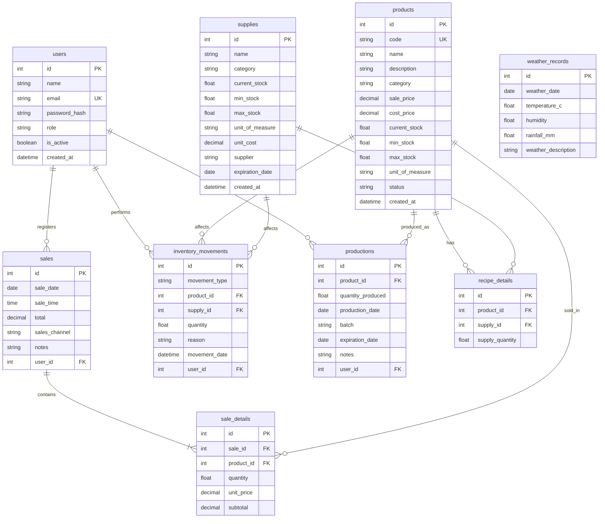

# Modelo entidad-relacion inicial

## Objetivo

Definir la estructura minima de datos para soportar usuarios, productos, insumos, ventas, inventario, produccion, recetas y registros de clima.

## Entidades principales

- `users`: usuarios del sistema con rol y estado.
- `products`: catalogo de productos terminados.
- `supplies`: insumos usados en produccion.
- `sales`: encabezado de ventas registradas por usuario.
- `sale_details`: detalle de productos vendidos por venta.
- `inventory_movements`: auditoria de entradas, salidas y mermas sobre productos o insumos.
- `productions`: lotes producidos por producto y usuario.
- `recipe_details`: relacion entre producto e insumo para definir recetas.
- `weather_records`: tabla preparada para registrar clima manual por fecha.

## Relaciones clave

- Un `user` puede registrar muchas `sales`.
- Un `user` puede registrar muchos `inventory_movements`.
- Un `user` puede registrar muchas `productions`.
- Una `sale` tiene muchos `sale_details`.
- Un `product` puede aparecer en muchos `sale_details`.
- Un `product` puede tener muchas `productions`.
- Un `product` puede tener muchos `recipe_details`.
- Un `supply` puede aparecer en muchos `recipe_details`.
- Un `product` o un `supply` puede participar en `inventory_movements`.

## Reglas de modelado inicial

- Correos de usuario unicos.
- Codigo de producto unico.
- Cantidades y precios no negativos.
- `inventory_movements` permite apuntar a producto o insumo, pero no exige ambos.
- Las recetas se modelan como detalle por producto e insumo.
- El clima se deja desacoplado para futura correlacion con ventas.

## Diagrama

